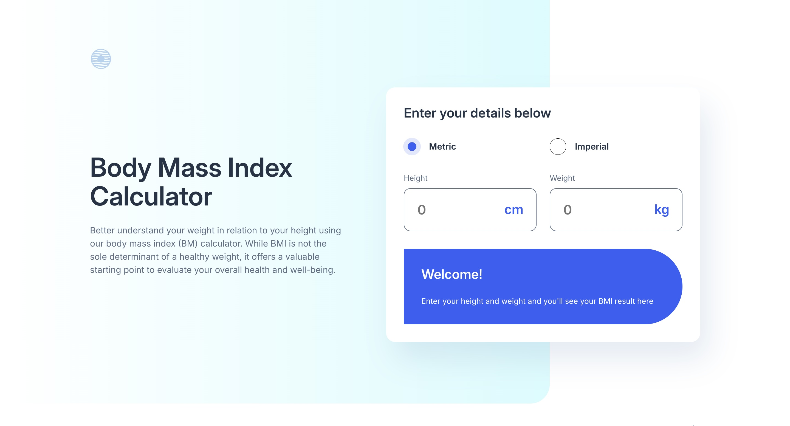

# Frontend Mentor - Body Mass Index Calculator solution

This is a solution to the [Body Mass Index Calculator challenge on Frontend Mentor](https://www.frontendmentor.io/challenges/body-mass-index-calculator-brrBkfSz1T). Frontend Mentor challenges help you improve your coding skills by building realistic projects.

## Table of contents

-   [Overview](#overview)
    -   [The challenge](#the-challenge)
    -   [Screenshot](#screenshot)
    -   [Links](#links)
-   [My process](#my-process)
    -   [Built with](#built-with)
    -   [What I learned](#what-i-learned)
-   [Author](#author)

**Note: Delete this note and update the table of contents based on what sections you keep.**

## Overview

### The challenge

Users should be able to:

-   Select whether they want to use metric or imperial units
-   Enter their height and weight
-   See their BMI result, with their weight classification and healthy weight range
-   View the optimal layout for the interface depending on their device's screen size
-   See hover and focus states for all interactive elements on the page

### Screenshot



### Links

-   Solution URL: [https://github.com/Joshk7/bmi-calculator](https://github.com/Joshk7/bmi-calculator)
-   Live Site URL: [https://bmi-calculator-tau-ruby.vercel.app/](https://bmi-calculator-tau-ruby.vercel.app/)

## My process

### Built with

-   Semantic HTML5 markup
-   CSS custom properties
-   Flexbox
-   CSS Grid
-   Mobile-first workflow

**Note: These are just examples. Delete this note and replace the list above with your own choices**

### What I learned

I used this challenge to practice CSS grid skills especially for the last section with all of the cards. I tried to focus on using semantic html for accessibility. I used an output tag within a form element for the main BMI calculator.

```html
<output class="calculation__output">
    <div id="empty" class="empty">
        <span class="empty__welcome"> Welcome! </span>
        <p class="empty__description">
            Enter your height and weight and you'll see your BMI result here
        </p>
    </div>
    <div id="active" class="active" aria-labelledby="">
        <div class="active__result">
            <span class="active__result--description"> Your BMI is... </span>
            <span id="result" class="active__result--value"> </span>
        </div>
        <p id="active-description" class="active__description"></p>
    </div>
</output>
```

Because these elements are wrapped in an output, any time an element is changed, VoiceOver on mac will announce the value of the active state.

## Author

-   Website - [Joshua Kahlbaugh](https://joshuakahlbaugh.pages.dev/)
-   Frontend Mentor - [@Joshk7](https://www.frontendmentor.io/profile/Joshk7)
